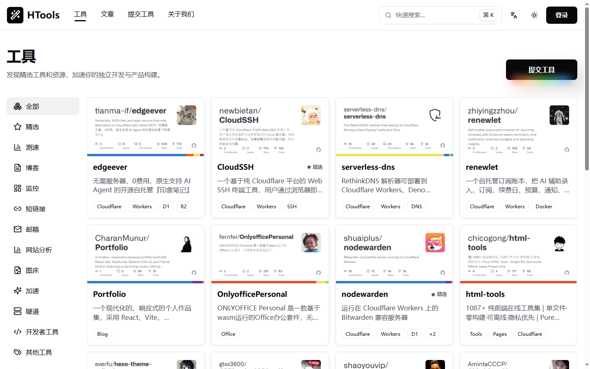
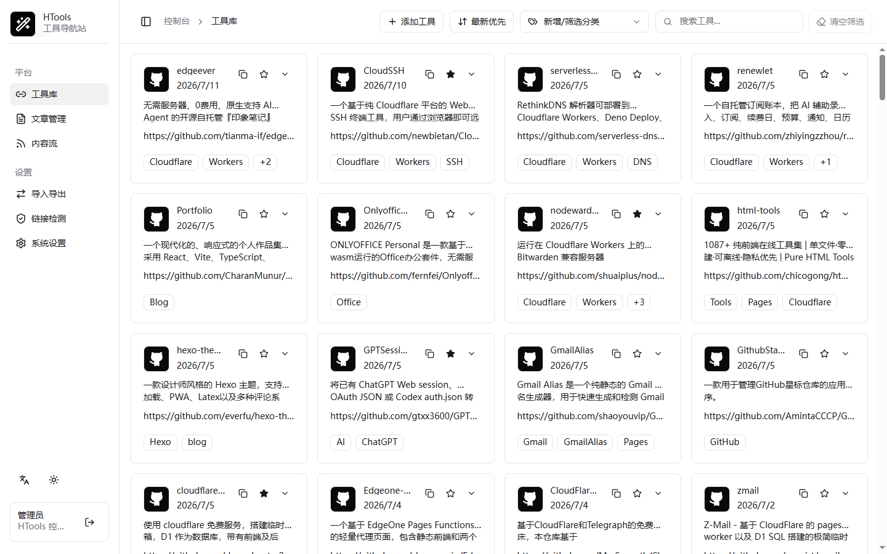

# HTools

HTools 是一款部署在 Cloudflare Pages Functions + D1 上的开源工具导航站，可用于搭建工具库、文章页和内容流聚合后台。

<p align="center">
  <a href="https://pages.cloudflare.com/"></a>
  <a href="./LICENSE"></a>
  <a href="https://github.com/shaoyouvip/htools/releases/latest"></a>
</p>

<p align="center">
  <a href="https://t.me/lsmkc">Telegram 频道</a> |
  <a href="https://t.me/lsmoo">Telegram 群组</a>
</p>

<p align="center">
  <a href="README_EN.md">English</a> | 简体中文 |
  <a href="https://blog.zrf.me/p/HTools/">部署教程</a>
</p>

## 演示截图





## 功能

- 前台提供工具分类、文章、工具提交和关于页面。
- 后台集中管理工具、文章、RSS 内容源、分类和系统设置。
- RSS 内容可临时浏览或转为站内文章，文章与关于页面支持 Markdown。
- 用户可读取 GitHub 仓库信息并前往 GitHub 创建公开 Issue；后台也可自动补全仓库元数据。
- 支持完整备份与恢复、公开工具订阅源及简体中文 / 英文界面。

## 部署

1. Fork 或导入本仓库到你的 GitHub。
2. 在 Cloudflare Pages 新建项目，并连接你的仓库。
3. Pages 构建设置填写：

```txt
构建命令：npm run build
构建输出目录：dist
```

4. 在 Cloudflare D1 新建数据库，例如 `htools`。
5. 回到 Pages 项目设置，给 Functions 添加 D1 绑定：

```txt
变量名称：DB
D1 数据库：选择你刚创建的数据库
```

6. 按下方环境变量表在 Pages 部署环境中添加需要的变量，并将标记为 Secret 的内容使用加密变量保存。

7. 重新部署 Pages 项目。
8. 打开 `/admin` 登录后台。

首次访问 API 时会自动初始化或升级 D1 表结构，无需手动执行 Migration。数据库默认为空，可在后台导入默认订阅源或手动添加工具。

## 环境变量

项目实际读取的环境变量如下：

| 变量 | 必需 | 建议类型 | 用途 |
| --- | --- | --- | --- |
| `ADMIN_PASSWORD` | 是 | Secret | 后台登录密码和会话签名密钥，建议使用至少 12 位的独立强密码。 |
| `GITHUB_TOKEN` | 否 | Secret | 后台添加或编辑工具时读取公开 GitHub 仓库信息，并提高 GitHub API 请求限额。 |
| `TURNSTILE_SITE_KEY` | 否，需与私密密钥同时配置 | 普通变量 | Cloudflare Turnstile 站点密钥，供管理员登录页加载验证组件。 |
| `TURNSTILE_SECRET_KEY` | 否，需与站点密钥同时配置 | Secret | Cloudflare Turnstile 私密密钥，供服务端验证人机验证结果。 |

`GITHUB_TOKEN` 建议使用不含仓库写入、删除或管理权限的只读 Token。未配置时，后台改由管理员浏览器请求 GitHub 公开 API；前端提交页始终由访客浏览器直接请求，不会使用站点 Token。

使用 Turnstile 时，需在 Cloudflare 添加部署域名并同时配置两个密钥，重新部署后在后台“服务设置”中开启。

## 本地开发

```bash
npm install
npm run dev
```

如需手动初始化或排查 D1：

```bash
npm run db:init:local
npm run db:init:remote
```

## 数据源

- 默认工具源文件：[public/htools.json](public/htools.json)
- 默认工具源访问地址：[https://raw.githubusercontent.com/shaoyouvip/htools/refs/heads/main/public/htools.json](https://raw.githubusercontent.com/shaoyouvip/htools/refs/heads/main/public/htools.json)
- 当前站点公开源：`/api/htools.json`

默认工具源不会自动写入 D1，可在后台导入该地址或其他站点公开的 `/api/htools.json`。

## SEO 和订阅

- `/sitemap.xml`：公开页面和已发布文章的站点地图。
- `/rss.xml`：已发布文章的 RSS。
- `/rss.json`：已发布文章的 JSON Feed。
