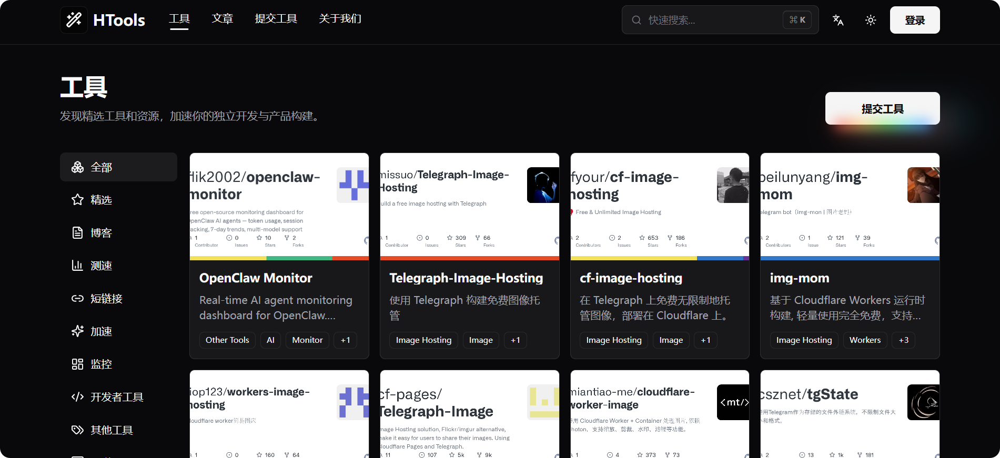
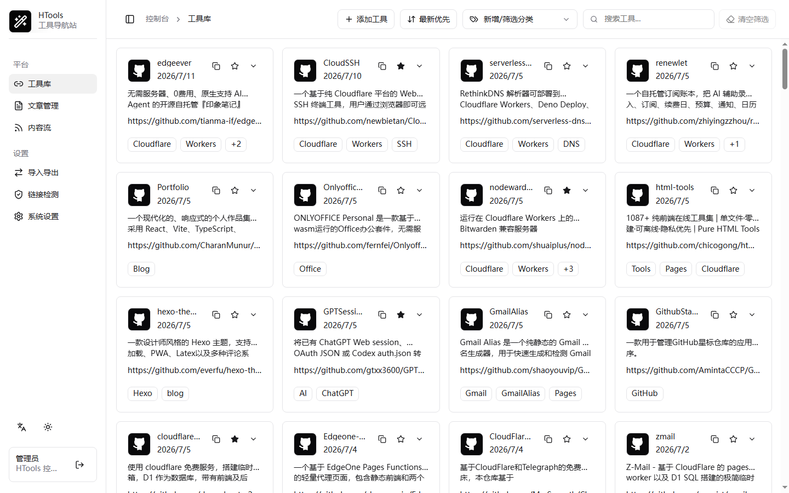

# HTools

HTools 是一款运行于 Cloudflare Pages Functions + D1 的开源工具导航平台，集工具收录、文章管理、RSS 内容聚合与 Telegram 消息推送于一体，无需部署传统服务器。

<p align="center">
  <a href="https://pages.cloudflare.com/"></a>
  <a href="./LICENSE"></a>
  <a href="https://github.com/shaoyouvip/htools/releases/latest"></a>
</p>

<p align="center">
  <a href="https://t.me/lsmkc">Telegram 频道</a> |
  <a href="https://t.me/lsmoo">Telegram 群组</a>
</p>

<p align="center">
  <a href="README_EN.md">English</a> | 简体中文 |
  <a href="https://blog.zrf.me/p/HTools/">部署教程</a>
</p>

## 演示截图





## 功能

- **工具导航**：分类浏览、全站搜索、精选推荐与公开工具提交。
- **内容管理**：文章与 RSS 订阅内容统一在后台管理，支持 Markdown 与转为站内文章。
- **消息推送**：工具、文章、订阅内容与自定义消息可推送到 Telegram，并集中浏览和更新。
- **GitHub 集成**：读取公开仓库信息，自动补全项目元数据。
- **Workers AI**（可选）：生成简介、摘要与标签，常见文档转 Markdown。
- **ImgBed 图床**（可选）：在后台直接上传图片并自动回填公开地址。
- **数据与体验**：完整备份恢复、公开工具订阅源、简体中文 / 英文界面与深浅色主题。

## 部署

1. Fork 或导入本仓库到你的 GitHub。
2. 在 Cloudflare Pages 新建项目，并连接你的仓库。
3. Pages 构建设置填写：

```txt
构建命令：npm run build
构建输出目录：dist
```

4. 在 Cloudflare D1 新建数据库，例如 `htools`。
5. 回到 Pages 项目设置，按下方“资源绑定”添加 `DB` 绑定；如需 Workers AI，同时添加 `AI` 绑定。
6. 按下方环境变量表在 Pages 部署环境中添加需要的变量，并将标记为 Secret 的内容使用加密变量保存。
7. 重新部署 Pages 项目。
8. 打开 `/admin` 登录后台。

首次访问 API 时会自动初始化或升级 D1 表结构，无需手动执行 Migration。数据库默认为空，可在后台导入默认订阅源或手动添加工具。

## 资源绑定

在 Pages 项目设置的 **Settings → Bindings** 中添加，绑定不是环境变量，不需要填写值：

| 变量名称 | 必需 | 类型 | 说明 |
| --- | --- | --- | --- |
| `DB` | 是 | D1 数据库 | 选择你创建的 D1 数据库，用于存储工具、文章、订阅内容和设置。 |
| `AI` | 否 | Workers AI | 启用后可在后台“服务设置”中选择模型并开启 AI 生成与文档转换。 |

## 环境变量

项目实际读取的环境变量如下：

| 变量 | 必需 | 建议类型 | 说明 |
| --- | --- | --- | --- |
| `ADMIN_PASSWORD` | 是 | Secret | 后台登录密码和会话签名密钥，建议使用至少 12 位的独立强密码。 |
| `GITHUB_TOKEN` | 否 | Secret | 提高后台读取公开 GitHub 仓库信息的请求限额，建议使用无写入、删除或管理权限的只读 Token；未配置时由管理员浏览器直接请求。 |
| `IMGBED_TOKEN` | 否 | Secret | [CloudFlare ImgBed](https://github.com/MarSeventh/CloudFlare-ImgBed) 的 API Token，建议只授予 `upload` 权限；重新部署后在后台“服务设置”填写图床地址和上传方式并开启。可为工具预览图、文章封面和 Telegram 推送图片上传 PNG、JPEG、WebP、GIF 或 AVIF，单张不超过 10MB。 |
| `TURNSTILE_SITE_KEY` | 否，需与私密密钥同时配置 | 普通变量 | 管理员登录页使用的 Turnstile 站点密钥，需与私密密钥同时配置。 |
| `TURNSTILE_SECRET_KEY` | 否，需与站点密钥同时配置 | Secret | 服务端验证 Turnstile 结果的私密密钥；需添加部署域名并重新部署，再到后台开启。 |
| `TGTOKEN` | 否 | Secret | Telegram Bot Token；重新部署后在后台填写接收目标、测试连接并开启。推送只由管理员手动触发。 |

## 本地开发

```bash
npm install
npm run dev
```

如需手动初始化或排查 D1：

```bash
npm run db:init:local
npm run db:init:remote
```

## 数据源

- 默认工具源文件：[public/htools.json](public/htools.json)
- 默认工具源访问地址：[https://raw.githubusercontent.com/shaoyouvip/htools/refs/heads/main/public/htools.json](https://raw.githubusercontent.com/shaoyouvip/htools/refs/heads/main/public/htools.json)
- 当前站点公开源：`/api/htools.json`

默认工具源不会自动写入 D1，可在后台导入该地址或其他站点公开的 `/api/htools.json`。

## SEO 和订阅

- `/sitemap.xml`：公开页面和已发布文章的站点地图。
- `/rss.xml`：已发布文章的 RSS。
- `/rss.json`：已发布文章的 JSON Feed。
